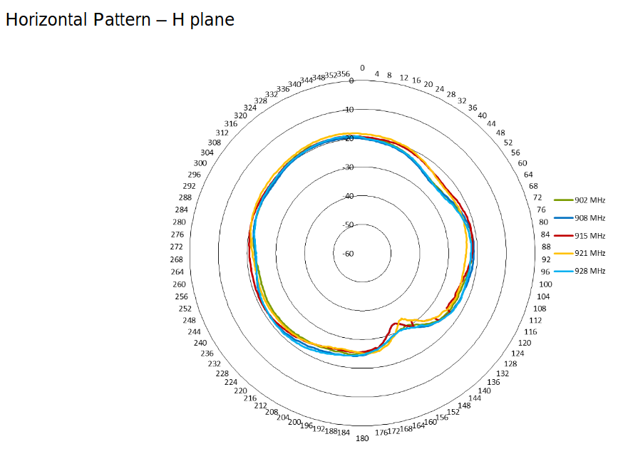
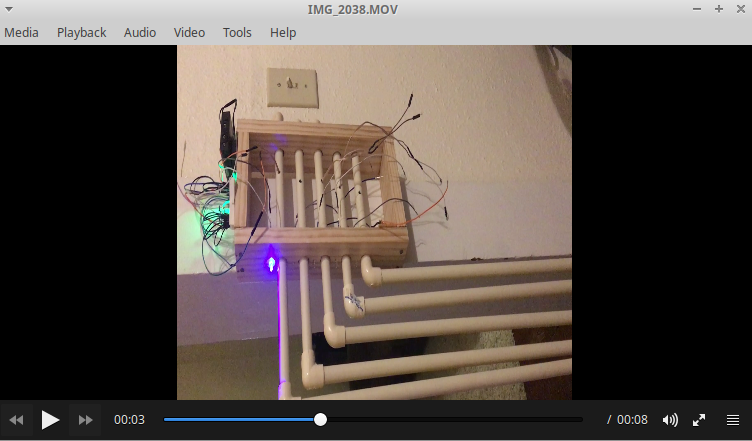

Topics covered below:

- [Gateway setup](#gateway)
- [Remote node setup](#remote)

## <a name="gateway">Gateway Setup</a>

Now that we have a field relay node design for capturing the soil moisture data and sending it to a LoRa gateway (based on the RAK / Raspberry Pi gateway), we are looking to optimize signal strength in the system.

## <a name="gateway">Remote Node Setup</a>

Several resources are available online around this.  I'll record them here later; but in particular, the tutorial I found particularly relevant was this one by Andreas Spiess:  ["What you always wanted to know about Antennas and nobody told you"](https://www.youtube.com/watch?v=J3PBL9oLPX8).  Summary lessons from this video:

- **Minimize the length of cable connecting the gateway to the external antenna**. 10s of feet of cable connecting the gateway to an external antenna -- even high quality, low-loss cable -- can reduce the signal range significantly (in kilometers).  Best to minimize this connection cable to the extent possible.
- **With good line of sight, very long distances should be possible.**
- **The 'Fresnel effect'** means that line of sight actually requires some margin above / below the direct line of sight.
- **Always connect an antenna to the sender**.  Without an antenna, energy is reflected back into the sender, potentially damaging the electronics.

The above leads me to think that our $50 [Sparkfun LoRa Fiberglass Antenna](https://www.sparkfun.com/products/15597), with its 5 dBi gain, is likely sufficient.  I was able to achieve 5 miles line-of-sight communication between relay node and gateway using this antenna.  The key variables to improve range seem to be: maximizing line-of-sight by increasing the height of the antenna, and using the shortest cable can to connect the gateway to the external antenna. 

If, however, we wanted another 3dBi gain, we could Opt for the [Taoglas OMB.915.B08F21](https://www.digikey.com/product-detail/en/taoglas-limited/OMB-915-B08F21/931-1519-ND/8275277), for $161. The datasheet indicates that it is still a fairly uniform / 'omni' antenna (which leads me to believe that our 5 dBi antenna, for which we don't have a datasheet, is likely even more uniform):

|  |
|:--:|
|Signal amplification in the horizontal plane.|

## Mounting the antenna

Nootropic Design has a [nice short article](https://nootropicdesign.com/projectlab/2018/10/27/lorawan-gateway/)  describing their deployment of a RAK gateway outdoors. We can ignore the GPS antenna;  this might be a cheap option for getting the fiberglass antenna mounted as high as possible.

|  |
|:--:|
|Example outdoor antenna mounting.|
